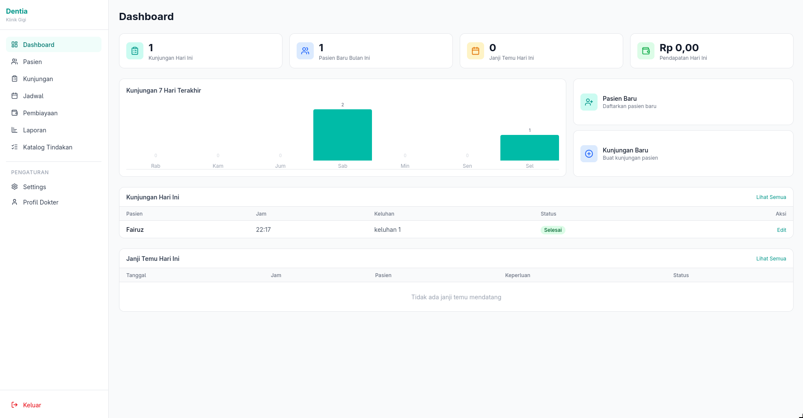
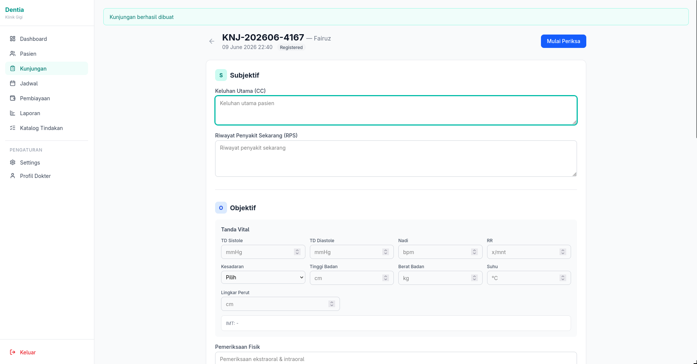
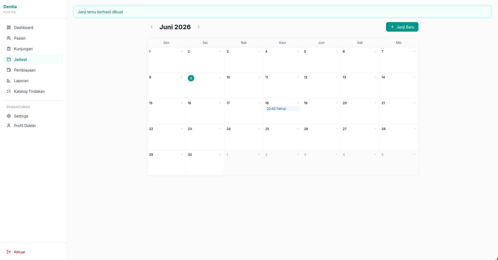
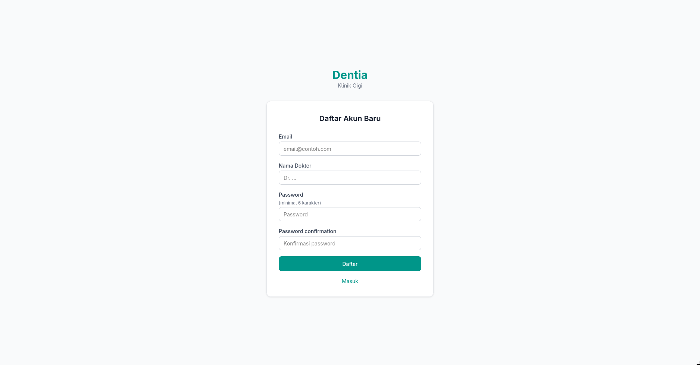

<div align="center">
  <h1>Dentia</h1>
  <p><strong>Sistem Informasi Manajemen Klinik Gigi</strong></p>
  <p>Aplikasi web untuk dokter gigi mandiri (<em>solo practice</em>) di Indonesia</p>
</div>

---

## Fitur

- **Autentikasi Multi-User** — Registrasi akun, login, ganti password, hapus akun
- **Data Pasien** — CRUD pasien, pencarian (nama/NIK/telepon), nomor RM random 5 digit
- **Rekam Medis SOAP** — Form lengkap dengan Subjektif, Objektif (tanda vital, odontogram), Assessment (ICD-10), Plan (resep + tindakan)
- **Odontogram SVG Interaktif** — 32 gigi dewasa (FDI) + 20 gigi anak, pilih status (karies, tambalan, cabut, dll) dengan 5 permukaan, panel simpan/batal
- **Katalog Tindakan** — Master data tindakan gigi (kode, nama, kategori)
- **Kunjungan** — Manajemen kunjungan dengan status (terdaftar → diperiksa → selesai), auto-billing saat selesai
- **Penjadwalan** — Kalender bulanan, buat/edit janji temu, auto-appointment dari kunjungan berikutnya
- **Pembiayaan** — Auto-generate billing dari tindakan, catat pembayaran (cash/transfer/BPJS/asuransi)
- **Dashboard** — Statistik harian (kunjungan, pasien baru, pendapatan), grafik 7 hari, shortcut
- **Laporan** — Filter tanggal, ringkasan kunjungan/pasien/pendapatan, export PDF & Excel (4 sheet)
- **Cetak Resep & Invoice** — PDF via Prawn dengan header klinik, format A5/A4
- **Dark Mode** — Toggle tema gelap, persist ke localStorage
- **Multi Bahasa** — Indonesia / English (beralih real-time)
- **Responsive Mobile** — Sidebar hamburger, tabel scroll horizontal, grid dinamis
- **Soft Delete** — Data pasien tidak hilang permanen (Discard gem)

---

## Tech Stack

| Teknologi | Kegunaan |
|-----------|----------|
| **Ruby on Rails 8.1** | Framework full-stack |
| **Hotwire** (Turbo + Stimulus) | Frontend interaktif tanpa React/Vue |
| **Tailwind CSS v4** | Styling utility-first |
| **PostgreSQL 16** | Database |
| **Devise** | Autentikasi |
| **Prawn + Prawn-Table** | Export PDF (resep, invoice, laporan) |
| **Caxlsx + Caxlsx-Rails** | Export Excel (laporan 4 sheet) |
| **Pagy** | Pagination |
| **Ransack** | Search & filter |
| **Discard** | Soft delete |
| **Lucide-Rails** | Icons |
| **Solid Queue** | Background jobs (built-in Rails 8) |
| **Docker** | PostgreSQL container |

---

## Prasyarat

- **Ruby** 3.4+
- **Bundler**
- **Docker** (untuk PostgreSQL)
- **Node.js** (untuk importmap)

---

## Cara Install & Running

### 1. Clone repositori

```bash
git clone https://github.com/Fairuzzzzz/dentia.git
cd dentia
```

### 2. Setup environment variables

```bash
cp .env.example .env
```

Isi file `.env`:
```env
DB_USERNAME=dentia
DB_PASSWORD=dentia_password
DB_NAME=dentia_development
```

### 3. Start PostgreSQL via Docker

```bash
docker compose up -d
```

### 4. Install dependencies

```bash
bundle install
```

### 5. Setup database

```bash
rails db:create db:migrate db:seed
```

### 6. Jalankan aplikasi

```bash
bin/dev
```

Akses di browser: **http://localhost:3000**

### Akun Default (seed)

| Email | Password |
|-------|----------|
| `dokter@klinikgigi.com` | `password123` |

---

## Docker Setup Detail

`compose.yaml` menjalankan PostgreSQL 16 dengan konfigurasi dari file `.env`:

```yaml
services:
  postgres:
    image: postgres:16
    environment:
      POSTGRES_USER: ${DB_USERNAME}
      POSTGRES_PASSWORD: ${DB_PASSWORD}
      POSTGRES_DB: ${DB_NAME}
    ports:
      - "5432:5432"
    volumes:
      - postgres_data:/var/lib/postgresql/data
```

Data database persist di volume `postgres_data`.

---

## Struktur Database

### Entity Relationship Diagram

```
patients ──┬── visits ──── medical_records ──┬── subjective_examinations
           │                                 ├── objective_examinations ── odontograms
           │                                 ├── assessments
           │                                 └── plans ──┬── prescriptions
           │                                             └── plan_treatments ── treatment_catalogs
           ├── appointments
           └── (user_id)

visits ──── billings ──── billing_items ──── plan_treatments
```

### Tabel Utama (14 tabel)

| Tabel | Keterangan |
|-------|------------|
| `users` | Akun dokter |
| `patients` | Data pasien (soft delete via discard) |
| `visits` | Kunjungan pasien |
| `medical_records` | Rekam medis (1 per kunjungan) |
| `subjective_examinations` | S — Subjektif (keluhan, RPS) |
| `objective_examinations` | O — Objektif (tanda vital, fisik) |
| `odontograms` | Data gigi (JSONB) |
| `assessments` | A — Assessment (ICD-10, diagnosis) |
| `plans` | P — Plan (resep, tindakan, follow-up) |
| `prescriptions` | Obat/resep |
| `plan_treatments` | Tindakan per plan |
| `treatment_catalogs` | Katalog tindakan (master data) |
| `appointments` | Janji temu |
| `billings` | Pembiayaan |
| `billing_items` | Detail billing per tindakan |

---

## Struktur Direktori

```
app/
├── controllers/
│   ├── application_controller.rb
│   ├── dashboard_controller.rb
│   ├── patients_controller.rb
│   ├── visits_controller.rb
│   ├── treatment_catalogs_controller.rb
│   ├── appointments_controller.rb
│   ├── billings_controller.rb
│   ├── reports_controller.rb
│   ├── profiles_controller.rb
│   ├── settings/
│   │   └── preferences_controller.rb
│   └── users/
│       └── registrations_controller.rb
├── models/
│   ├── user.rb, patient.rb, visit.rb, medical_record.rb
│   ├── subjective_examination.rb, objective_examination.rb
│   ├── odontogram.rb, assessment.rb, plan.rb
│   ├── prescription.rb, plan_treatment.rb
│   ├── treatment_catalog.rb, appointment.rb
│   ├── billing.rb, billing_item.rb
├── views/
│   ├── layouts/application.html.erb
│   ├── shared/_sidebar.html.erb, _flash.html.erb
│   ├── dashboard/, patients/, visits/
│   ├── treatment_catalogs/, appointments/
│   ├── billings/, reports/, profiles/
│   ├── settings/preferences/
│   └── devise/ (sessions, registrations)
└── javascript/controllers/
    ├── index.js
    ├── odontogram_controller.js
    ├── dark_mode_controller.js
    ├── mobile_menu_controller.js
    ├── nested_form_controller.js
```

---

## Rencana Pengembangan

- [ ] **Autocomplete ICD-10** — Daftar kode ICD untuk diagnosis gigi di form Assessment
- [ ] **Template Resep** — Resep dengan dosis standar yang bisa dipilih cepat
- [ ] **Riwayat Pasien** — Tab riwayat lengkap (kunjungan, billing, odontogram)
- [ ] **Notifikasi** — Pengingat janji temu via email/WhatsApp
- [ ] **Multi Klinik** — Dukungan untuk beberapa klinik dalam satu akun
- [ ] **API** — REST API untuk integrasi dengan sistem lain
- [ ] **CI/CD** — GitHub Actions untuk test otomatis

---

## Screenshots

| | |
|:---:|:---:|
|  |  |
| **Dashboard** — Ringkasan harian, grafik, shortcut | **SOAP Form** — Rekam medis Subjektif, Objektif, Assessment, Plan |
|  |  |
| **Kalender** — Janji temu bulanan | **Register** — Pendaftaran akun baru |

---

## Lisensi

MIT License — silakan gunakan, modifikasi, dan distribusikan.

---

## Kontribusi

1. Fork repositori
2. Buat branch fitur (`git checkout -b fitur-keren`)
3. Commit perubahan (`git commit -m 'Tambah fitur keren'`)
4. Push ke branch (`git push origin fitur-keren`)
5. Buat Pull Request
